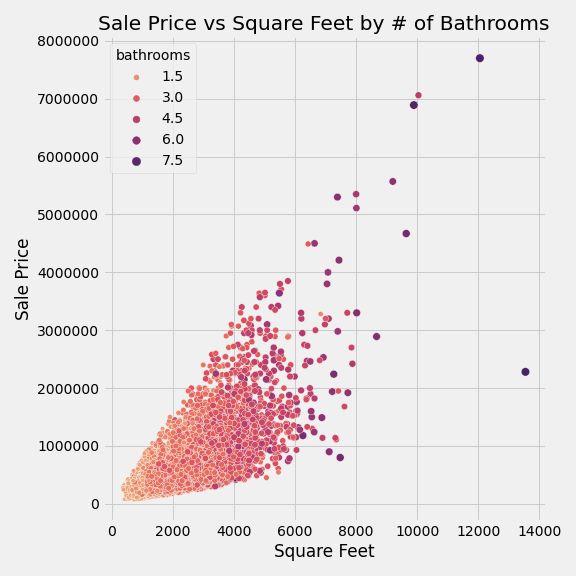
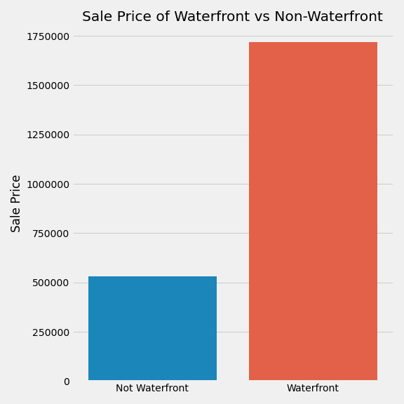
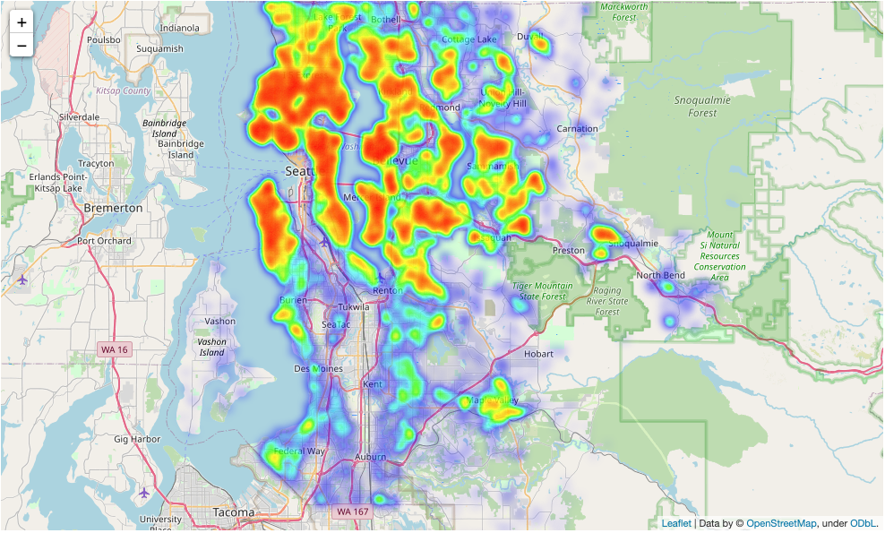

# Analysis of King County Home Prices

**Authors:** Aaron Cherry, Ryan Reilly

## Overview

This project analyzes data for over 21,000 home sales in King County, WA during 2014 and 2015. The goal of this analysis is to determine what features of a house drive the sale price. This will be done through exploratory daa analysis and inferential linear regression modeling of the housing data.

## Business Problem

Blue Sky Realty is a large real estate agency that helps homeowners buy/sell homes. Blue Sky has a large presence on the west coast, primarily in California and Oregon. However, they still have not expanded to Washington, until now. This will be there first office in Washington and their knowledge of what drives home prices is limited. They will be starting in King County. Since they are new to King County, they have requested our assistance. Through our analysis, we are going to provide recommendations to Blue Sky based on the following:

- Where to sell a home based on recent trends
- Which features of the home will drive the sale price of your clients home

## Data Understanding

The dataset consists of features, ID and date of sale for over 21,000 houses within the King County area between the May 2014 and May 2015. This data was aquired from through Kaggle and the original data can be found [here](https://www.kaggle.com/harlfoxem/housesalesprediction/discussion/207885). The following table describes how each of the features are interpreted.

| Feature | Description|
|:------- | :-------|
|id| Unique ID for each home sold|
|date|  Date of the home sale|
|price| Price of each home sold|
|bedrooms|  Number of bedrooms|
|bathrooms|  Number of bathrooms, where .5 accounts for a room with a toilet but no shower|
|sqft_living|  Square footage of the apartments interior living space|
|sqft_lot|  Square footage of the land space|
|floors|  Number of floors|
|waterfront|  A dummy variable for whether the apartment was overlooking the waterfront or not|
|view|  An index from 0 to 4 of how good the view of the property was|
|condition|  An index from 1 to 5 on the condition of the apartment,|
|grade|  An index from 1 to 13, where 1-3 falls short of building construction and design, 7 has an average level of construction and design, and 11-13 have a high quality level of construction and design.|
|sqft_above|  The square footage of the interior housing space that is above ground level|
|sqft_basement|  The square footage of the interior housing space that is below ground level|
|yr_built|  The year the house was initially built|
|yr_renovated|  The year of the house’s last renovation|
|zipcode|  What zipcode area the house is in|
|lat|  Lattitude|
|long|  Longitude|
|sqft_living15|  The square footage of interior housing living space for the nearest 15 neighbors|
|sqft_lot15|  The square footage of the land lots of the nearest 15 neighbors|

## Data Preparation
Many of the features within the data set were sufficient for statistical analyses. There were some features, however, that presented with missing data, required data type conversion or alteration of some of the entries. The columns that required processing as well as the method are listed:

- **Waterfront**: There was missing information in this feature and it does not make sense for that value to be missing (the home is either on waterfront or it isn't). The missing data were filled with a 0 assuming most homes would not have a waterfront view.
- **Year Renovated**: There was missing information for this feature and many houses were labeled '0.0'. It was assumed that both of which indicated houses that had never been renovated and were marked as a 0 for never renovated. The houses that had a year were then marked as a 1 symbolizing that the house had been renovated.
- **View**: There was missing information for this feature, however, there were few houses missing this feature. The missing information was filled with the mode of 0 for the entire feild.
- **Date**: The data type was converted to a datetime and new columns were created for the month in order to view sales by season.
**TODO: add variables that were changed from continuaous numeric to nominal**

#### Dealing with outliers

Of all the numerical variables, the one one house with 33 bedrooms and only 1620 square feet and 3 bedrooms did not make sense and so was removed from the data.

# Feature Engineering

Some of the features within the data were recategorized to form a more complete understanding of the features that had a seemingly large impact on sale price. The major feature being the grade of the house. A new feature was made based on the grade of the house using the following schema:
- **low** (< 3): Houses falling short of building design specifications.
- **medium** : Houses with an overall average quality.
- **high** (>= 11): Houses with a high quality of design.
**TODO: add other features that were engineered for modeling**

# Exploratory Data Analysis

The following exploratory analysis and data visualizations are shown to display the relationships between the features and the sale price. The purpose is to identify potential features that would have a high impact on the sale price and could potentially be used as predictors in our models.

**Correlation** The following correlation table gives a summary of the features' correlation with the sale price of a house and each other. The table can be used to define the features that have a strong linear relationship with the sale price making them candidates for potential predictors in our models:

**Considering Month Sold** Should a seller consider what time of year to list there home? Should a buyer consider when to buy a home? It looks like the most home were sold in May over the two year period of data we have. Home sales look to be hot in the spring and summer months, and slow down only slighlty in the fall and more so in the winter. 

- Do the number of bathrooms have an effect on the price of the house?

This scatter shows a positive relationship between square feet and sales price. You can see as the points get darker towards the top, the more bathrooms there are for a home. This shows that the number of bathrooms could help indicate the sale price. 

#### Would there be a great price difference whether or not a home is on the waterfront?

This barchart shows that waterfront homes are significantly more expensive than homes not on the waterfront. 
#### Would there be a great price difference whether or not a home is renovated?

This barchart shows that renovated homes increase the price of a home as you can see by the mean sales price of home renovated vs those that are not renovated.

#### Do prices of homes increase in certain areas of King County?

As we see from the heatmap, home prices increase as you move north in King County. The highest home prices tend to be those neighborhoods near water and closer to the downtown Seattle and Bellevue area. Particularly expensive areas include Medina, Mercer Island, Queen Ann in Seattle and Madison Park in Seattle. 

#### Is there a particular zipcode that tends to sell pricier homes?

This chart shows the mean price of a home in each zipcode. The mean price tends to go up as you get closer to Bellevue, Mercer Island, and Seattle. 

# Preprocessing and More Feature Engineering for Modeling

The above chart is showing a high correlation with sqft_living and multiple other variables. We may need to consider removing qft_above, grade, sqft_living15, and bathrooms.

It looks like we will need to transform the following variables because they are all heavily right positive skewed. We will be normalizing them using a log transformation. 

- price, 
- sqft_living, 
- sqft_living15, 
- sqft_lot, 
- sqft_lot15, 
- sqft_above, 
- age

# Modeling

#### First Simple Model
#### 2nd Model with more than 4 predictors

# Conclusions
**1. The Square footage of your home drives the sale price.**

**2. Insert Text **

**3. Insert Text **

**4. Insert Text **

# Next Steps

Further analyses could provide even more insight into how you will advise your clients to buy or sell thier home. 

**Better idea of neighborhood and surrounding neighborhoods.** We could gather more qualitative data on surrounding neighborhoods such as neighborhood safety, population demographics, and other idicators that may predict the price of a home. You could get an idea of proximity to schools, grocery stores, the city. These may play.

**Better idea of pricing history.** We could look at when the home sold last and for how much. You could then compare the price increases across homes and see the average percentage increase for similer homes.

**Better idea of sale history.** We had a fairly good sample of two years worth of data, but it would be good to gather even more years of sales data in King County further solidify reccomendations. There may be features of the home that are better at predicting sale price now then they were 5 or 10 years ago. 
