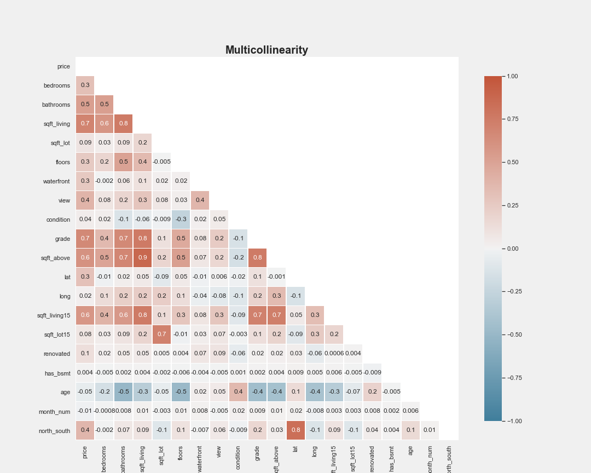
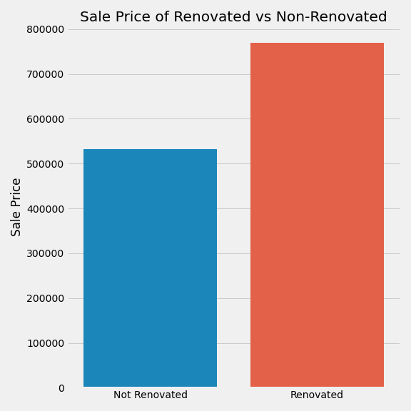
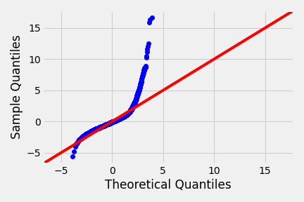
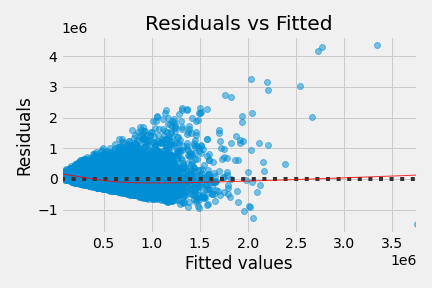
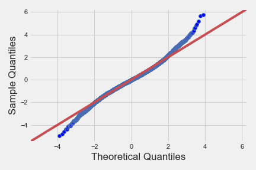
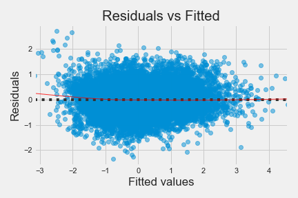

# Analysis of King County Home Prices

## Aaron Cherry, Ryan Reilly

## Overview

This project analyzes data for over 21,000 home sales in King County, WA during 2014 and 2015. The goal of this analysis is to determine what features of a house drive the sale price. This will be done through exploratory daa analysis and inferential linear regression modeling of the housing data.

## Business Problem

Blue Sky Realty is a large real estate agency that helps homeowners buy/sell homes. Blue Sky has a large presence on the west coast, primarily in California and Oregon. However, they still have not expanded to Washington, until now. This will be there first office in Washington and there knowledge of what drives home prices is limited. They will be starting in King County. Since they are new to King County, they have requested our assistance to find out what feature in a home increase the sell price in the county. Through our analysis, we are going to provide recommendations to Blue Sky based on the following:

- Where to sell a home based on recent trends
- Whether to renovate and what kinds of renovations are best
- What time of the year is best to sell homes

## Data Understanding

The dataset consists of features, ID and date of sale for over 21,000 houses within the King County area between the May 2014 and May 2015. This data was aquired from through Kaggle and the original data can be found [here](https://www.kaggle.com/harlfoxem/housesalesprediction/discussion/207885). The following table describes how each of the features are interpreted. This table was taken from a previous [study](https://www.slideshare.net/PawanShivhare1/predicting-king-county-house-prices) of the data.

| Feature | Description|
|:------- | :-------|
|id| Unique ID for each home sold|
|date|  Date of the home sale|
|price| Price of each home sold|
|bedrooms|  Number of bedrooms|
|bathrooms|  Number of bathrooms, where .5 accounts for a room with a toilet but no shower|
|sqft_living|  Square footage of the homes interior living space|
|sqft_lot|  Square footage of the land space|
|floors|  Number of floors|
|waterfront|  A dummy variable for whether the home was overlooking the waterfront or not|
|view|  An index from 0 to 4 of how good the view of the property was|
|condition|  An index from 1 to 5 on the condition of the home,|
|grade|  An index from 1 to 13, where 1-3 falls short of building construction and design, 7 has an average level of construction and design, and 11-13 have a high quality level of construction and design.|
|sqft_above|  The square footage of the interior housing space that is above ground level|
|sqft_basement|  The square footage of the interior housing space that is below ground level|
|yr_built|  The year the house was initially built|
|yr_renovated|  The year of the house’s last renovation|
|zipcode|  What zipcode area the house is in|
|lat|  Lattitude|
|long|  Longitude|
|sqft_living15|  The square footage of interior housing living space for the nearest 15 neighbors|
|sqft_lot15|  The square footage of the land lots of the nearest 15 neighbors|

## Data Preparation
Many of the features within the data set were sufficient for statistical analyses. There were some features, however, that presented with missing data, required data type conversion or alteration of some of the entries. The columns that required processing as well as the method are listed:

- **Waterfront**: There was missing information in this feature and it does not make sense for that value to be missing (the home is either on waterfront or it isn't). The missing data were filled with a 0 assuming most homes would not have a waterfront view.
- **Year Renovated**: There was missing information for this feature and many houses were labeled '0.0'. It was assumed that both of which indicated houses that had never been renovated and were marked as a 0 for never renovated. The houses that had a year were then marked as a 1 symbolizing that the house had been renovated.
- **View**: There was missing information for this feature, however, there were few houses missing this feature. The missing information was filled with the mode of 0 for the entire feild. Changed type from continuous to nominal.
- **Date**: The data type was converted to a datetime and new columns were created for the month in order to view sales by season.
- **Id**: Dropped Id column

#### Dealing with outliers

Of all the numerical variables, the one one house with 33 bedrooms and only 1620 square feet and 3 bedrooms did not make sense and so was removed from the data.

# Feature Engineering

Some of the features within the data were recategorized to form a more complete understanding of the features that had a seemingly large impact on sale price. The major feature being the grade of the house. A new feature was made based on the grade of the house using the following schema:

- **low** (grade<3): Houses falling short of building design specifications.
- **medium** : Houses with an overall average quality.
- **high** (grade>= 11): Houses with a high quality of design.

Other Feature Engineering:
- **Renovated**: Added column with values 1 (rennovated) and 0 (not renovated)
- **Age**: Added age of the home from the start of the year 2016
- **Season**: Added season the home was sold
- **North-South** : Added column of whether the home was above or below latitude: 47.5 based on EDA
# Exploratory Data Analysis

The following exploratory analysis and data visualizations are shown to display the relationships between the features and the sale price. The purpose is to identify potential features that would have a high impact on the sale price and could potentially be used as predictors in our models.

**Correlation** The following correlation table gives a summary of the features' correlation with the sale price of a house and each other. The table can be used to define the features that have a strong linear relationship with the sale price making them candidates for potential predictors in our models: 

**Considering Month Sold** Should a seller consider what time of year to list there home? Should a buyer consider when to buy a home? It looks like the most home were sold in May over the two year period of data we have. Home sales look to be hot in the spring and summer months, and slow down only slighlty in the fall and more so in the winter. 

**Considering Square Footage of the Home and Number of Bathrooms** This scatter shows a positive relationship between square feet and sales price. You can see as the points get darker towards the top, the more bathrooms there are for a home. This shows that the number of bathrooms could help indicate the sale price. 

**Considering Waterfront Homes** The barchart below shows that waterfront homes are significantly more expensive on average than homes not on the waterfront. Homes on the waterfront look to be 3x more expensive in King County. 

**Considering Renovation** The barchart below shows that renovated homes increase the price of a home as you can see by the mean sales price of home renovated vs those that are not renovated. Renovating a home increases the average sale price by at least 25%.

**Considering the Location of the Home** As you can see from the heatmap below, home prices increase as you move north in King County. The highest home prices tend to be those neighborhoods near water and closer to the downtown Seattle and Bellevue area. Particularly expensive areas include Medina, Mercer Island, Queen Ann in Seattle and Madison Park in Seattle. 

The heat map below shows home prices increase as you move north in King County. The highest home prices tend to be those neighborhoods near water and closer to the downtown Seattle and Bellevue area. Particularly expensive areas include Medina, Mercer Island, Queen Ann in Seattle and Madison Park in Seattle. 

# Modeling
All models implemented are linear regression models using selected features. The models produced coefficients that gave an idea of correlations with the target: sale price of the home.

#### First Simple Model

For the first model, we aimed to define a simple relationship with the square footage of the home and the selling price of the home. The square footage of the home was shown to be siginificant in determining the sale price of a house. For every one square foot increase, the sale price increases by $280. The model showed a small p value suggesting the overall significance of square footage; however, the R-squared value, .493 shows a subpar fit of the data. The first model showed a violation of our assumption of normal distributions as can be seen by the QQ-plot and the Residual vs. Fitted graphs below: 

#### 2nd Model
For the second model, we aimed to correct the non normally distributed target and predictor of suqare foot of living. The second model performed slightly worse with an R-squared value of 0.455. The heteroskedasticity of the residuals and the non-normalities of the target and predictor we corrected as can be seen in the QQ-plot and the Residual vs. Fitted graphs below: 

#### 3rd Model
For the third model, we were concerned with increasing the performance of the linear regression by adding more house features to the model. We showed a 58% increase in performance with an R-squared of .789. The continuous features as well as the target were log transformed and scaled so that the assumptions of linear regression were met. This can be seen from the QQ-plot and the Residual vs. Fitted graphs below. As you can se, the residuals are normal and homoskedastic thus keeping with the assumptions for linear regression. 

#### 4th Model (Final)
For the fourth model, we were concerned with the multicolinearities between some of the features and their effect on the performance of the model. The following tabel shows the highly colinear variables. As the square foot of living was one of the highes correlated features with the sales price of the home, we decided to drop the features that we colinear with the feature. We also dropped the has_basement and log transformed square foot above ground features as they showed a low correlation with the sales price of the home. 

|pairs	|Covariance|
|:------- | :-------|
|(sqft_above, sqft_living)|	0.876448|
|(north_south, lat)|	0.832996|
|(sqft_living, grade)|	0.762776|
|(sqft_living, sqft_living15)|	0.756400|
|(grade, sqft_above)|	0.756069|
|(bathrooms, sqft_living)|	0.755755|

The fourth model showed a slight decrease in performance with an R-squared value of .778. This was to be expected as some of the features dropped showed a high correlation with the sales price. By removing multicolinearities, however, we improved the model by eliminating some violations of the assumptions of the linear regression.

#### Model Conclusions
The final model showed that the location of the house, the square foot living area of the home, the overall grade given to the home, and whether or not the home was renovated had the highest coefficients showing that they were the most correlated with the sale price. The following figure shows the coefficients for the features used in the final model. 

# Conclusions
1. **Best to sell homes from the northern side of King County, and waterfront homes.** Our analysis shows that as you move north in King County, homes tend to sell for a higher price. The prices also increase as you get closer to the big cities and closer to the waterfront.

2. **Recommend clients to renovate to increase property value.** Our analysis shows that renovated homes sell for a higher price than those homes not renovated. Our models show that renovating to increase square footage increases the sale price and consider adding extra bathrooms in the renovation as that also increases the price. Also consider improving the view of the home when renovating.

3. **Consider selling in the late spring, early summer.** The most homes wre sold in May for both years of our data. Homes tend to increase in sales during the spring and tend decrease slightly in the winter months.

# Next Steps

Further analyses could provide even more insight into how you will advise your clients to buy or sell thier home.

**Better idea of features of a home.** Other features that indacate home sale include the color of the home, number of windows, garage indicator, size of garage, pool indicator, size of lawn, full property size, flood indicater, style of the home, among others.

**Better idea of neighborhood and surrounding neighborhoods.** We could gather more qualitative data on surrounding neighborhoods such as neighborhood safety, population demographics, and other idicators that may predict the price of a home. You could get an idea of proximity to schools, grocery stores, the city.

**Better idea of surrounding counties in Washington.** We could gather data from other counties and compare, county to county, how sale prices fluctuate. Other macro indicators of county could be political climate, social programs, broader proxiimity to major highways.

**Better idea of sale history.** We had a fairly good sample of two years worth of data, but it would be good to gather even more years of sales data in King County further solidify reccomendations. There may be features of the home that are better at predicting sale price now then they were 5 or 10 years ago.

# Contributers
Ryan Reilly
- Email: ryan.m.reilly@gmail.com
- Github: https://github.com/ryanreilly
- Linkedin:https://www.linkedin.com/in/ryanreilly1/

Aaron Cherry
- Email: cherrya050@gmail.com
- Github: https://github.com/JCherryA050
- Linkedin: https://www.linkedin.com/in/aaron-cherry-8aa728124/
